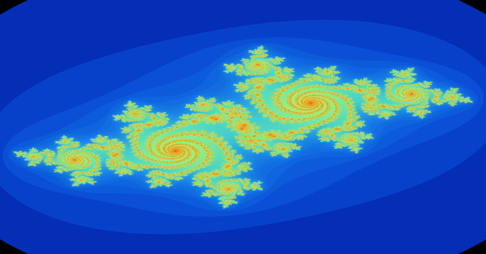

# Julia

[](https://github.com/wxkim/julia/actions/workflows/linux.yml)

## Fractal Renderer (Minimal C/OpenGL)

This project renders Julia fractals in C using multithreading.

Developed on x86_64.

## Build and Run

Make sure you have OpenGL and GLUT development libraries installed. Install `make` to support the `makefile`.

> If you are on Windows, use MINGW64.

### To build:

```bash
make -jN
```

### To run:

```bash
make run
```

### To clean:

```bash
make clean
```

### All in one command on default settings:

```bash
clear; make clean; make; make run
```

## Arguments

## Directory Structure

```.
├── README.md
├── julia.exe
├── makefile
├── core
│   ├── args.c
│   ├── args.h
│   ├── core.h
│   ├── error.h
│   ├── thread.c
│   └── thread.h
├── display
│   ├── buffer.c
│   ├── buffer.h
│   ├── color.c
│   ├── color.h
│   ├── render.c
│   └── render.h
├── inc
│   ├── complex.h
│   ├── julia.h
│   ├── main.h
│   └── pmath.h
└── src
    ├── complex.c
    ├── julia.c
    ├── main.c
    └── pmath.c

5 directories, 23 files


```

## Gallery

<div style="text-align: center;">
  
</div>

A generated Julia fractal, characteristic equation coefficients z = x + yi, c = -0.5125 + 0.5213i. Color scheme: gradient.

---

<div style="text-align: center;">
  
</div>

A generated Mandelbrot fractal, characteristic equation coefficients z = 0 + 0i, c = x + yi. Color scheme: 8-bit RGB.

---

<div style="text-align: center;">
  
</div>

A generated Julia fractal, characteristic equation coefficients z = x + yi, c = 0.355 + 0.355i. Color scheme: Greyscale.
